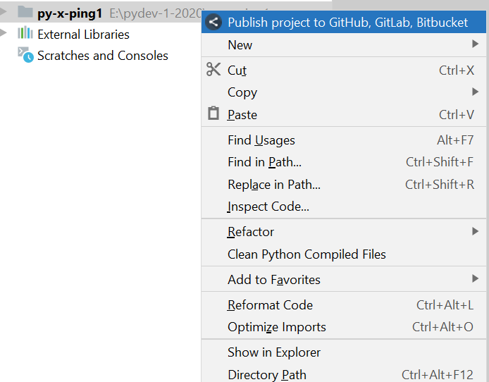
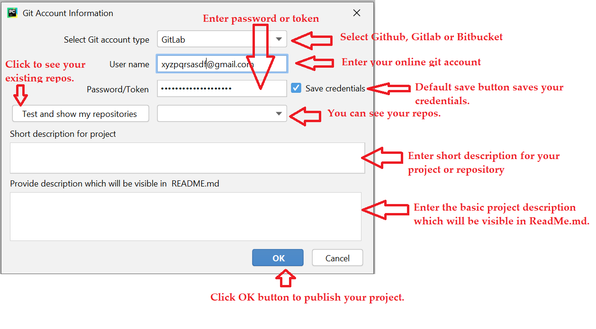
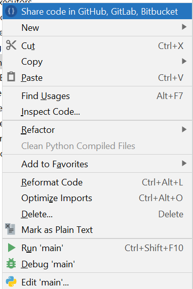
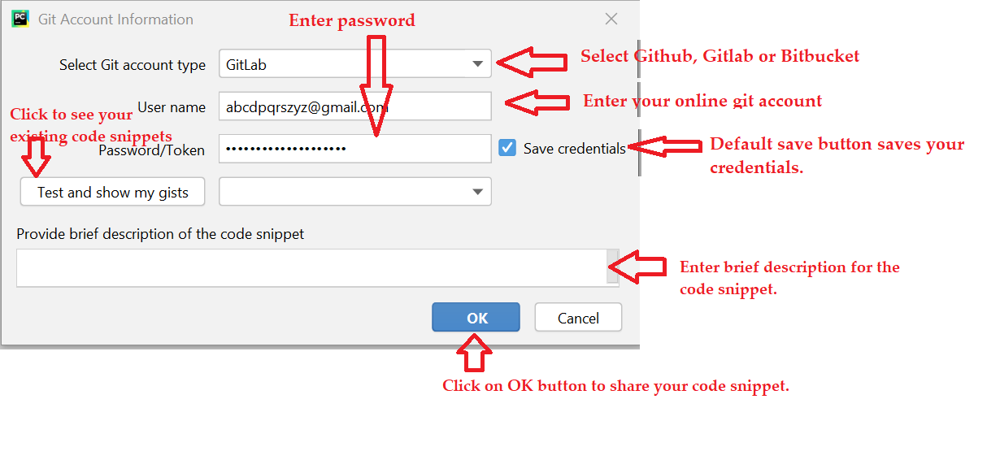

 

CodePublisher IntelliJ IDEA Plugin to publish code in GitHub, GitLab or Bitbucket
==========================================================================================

Introduction
============
**Code Publisher** is an IntelliJ IDEA Plugin which helps in publishing and sharing the complete codebase or code snippet directly to GitHub, GitLab or Bitbucket. This plugin does not provide any git functionality, it only provides an easy way to keep the code in [GitHub.com](https://github.com/), [GitLab.com](https://gitlab.com/) or [Bitbucket.com](https://bitbucket.org/) for future references. Many times, developers write good code for some POC and code goes into lost world after some time. This plugin will help you to save and share your code in[GitHub.com](https://github.com/), [GitLab.com](https://gitlab.com/) or [Bitbucket.com](https://bitbucket.org/).

Advantages of Code Publisher
================

* **A hassle free way to publish code base in [GitHub.com](https://github.com/), [GitLab.com](https://gitlab.com/) or [Bitbucket.com](https://bitbucket.org/).**
* **Easy to create a code snippet and share with your friends.**
* **A non blocking way to publish the code or code snippet.**
* **Easy to work as it has been developed using pure java and it is free and open source.**

Technology Stack
================
The following framework/s and tool/s have been used in this current sample application.

<table border="1">
  <tr>
    <th>Name</th>
    <th>Version</th> 
  </tr>
  <tr>
    <td>Java</td>
    <td>1.8</td> 
  </tr>
  <tr>
    <td>IntelliJ Platform (Open API & Swing)</td>
    <td>2020</td>
  </tr>
  <tr>
    <td>Gradle</td>
    <td>4.9</td>
  </tr>
  <tr>
    <td>Eclipse eGit framework</td>
    <td>5.2</td> 
  </tr>
</table>

How to use it ?
===============
Go to File -> Settings -> Plugins and type `DDLAB Codepublisher` in intellij idea marketplace and click the button `install`. The screenshot is given below.

See the screenshots give below to know its usage.

* **To create a project in GitHub, Gitlab, Bitbucket**
  
  Right click on a project and click the menu item and enter all the required information.

* **To create a Gist in GitHub or Snippet in Bitbucket**

  Right click on a file and click the menu item and enter all the required information.

Bugs and Feedback
=================
There may be some bugs or error, please feel free to report to me at deba.java@gmail.com

Contributor
==========
@Author : **Debadatta Mishra (PIKU)** [Know me](https://about.me/debadattamishra)

Conclusion
==========
Hope you have enjoyed my small utility plugin, try to learn and explore more and share with all.

